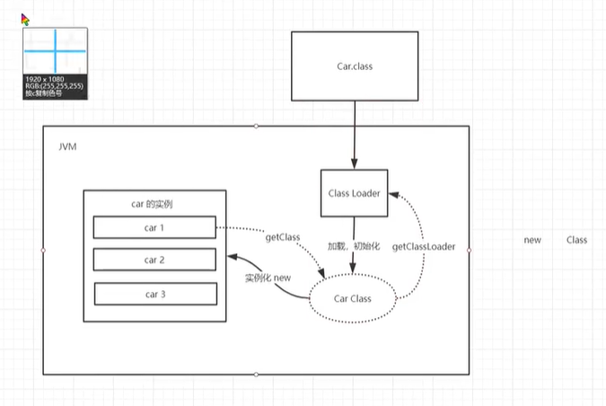

#  类加载器及双亲委派机制

### Lombok是咋回事

1. 他会在程序运行的时候给我们动态生成get，set方法
2. 因为程序加载的时候会解析一棵树，Lombok在这个语法树上去解析
3. 只能执行引擎和类加载器加个钩子，大多数框架是在执行引擎上动

### 类加载器

1. 作用：加载class文件 

2. new Student() 的时候 引用放在栈里面 具体的对象放在堆里面

3. 现在有一个class文件进入到JVM中，先到类加载器中进行加载初始化 这个class是反射那个class（Student.class）

4. 类是一个模板是抽象的 而对象是具体的

5. 类放到Class Loader里面会加载并初始化 而产生的这个class是用来做实例化的

6. 实例化的关键词就是new

7. 一个对象也可以获得class 只要使用getClass方法

   ```java
   Car car1 = new Car(); //实例化一个Car对象 他的名字（引用）在栈里面 具体的对象在堆里面 找的方法是使用的内存地址
   Class<? extends Car> aClass= car1.getClass();
   ```

8. 使用Class对象我们也可以使用getClassLoader()方法反向获得ClassLoader对象

   ```java
   ClassLoader classLoader = aClass.getClassLoader();
   System.out.println(classLoader);//这里打印的类加载器信息中说明这个类加载器是AppClassLoader 也就是用户类加载器 用户类加载器在rt里面的java.long包里面
   ```

   ​



9. 类加载器分为：虚拟机自带的加载器，启动类（根）加载器，扩展类加载器，应用程序（系统）加载器

```java
System.out.println(classLoader.getParent()); //类加载器的父类 ExtClassLoader 扩展类加载器在jre/lib/ext里面
System.out.println(classLoader.getParent().getParent());//类加载器的父类的父类 null 可能是不存在（√）  可能是获取不到 我们去jre里面找到rt.jar 大公司里面有的会直接改java环境
```

10. 我们会发现，如果我们创建的项目中出现与jre环境中同包同名的项目的时候运行时会报错，比如会提示没有main方法

### 双亲委派机制

1. 双亲委派是为了保障安全的
2. 运行一个类之前会向上找 比如先找到APP加载器 然后找到EXT加载器 之后又去找BOOTSTRAPT加载器
3. 最终执行的是根加载器里面的，所以同包同名的会报错
4. 但是一旦发现根加载器里面没有，就开始倒着走 回到EXT加载器里找 EXT加载器还没有才去当前APP加载器找
5. 为了定义一些安全的东西可以去修改ext里面的东西 尽量不要去修改rt.jar
6. 要知道一个类是从哪个加载器里面出来的，就直接getClass()之后再getClassLoader()就可以输出了
7. 祖父类加载器找不到的原因是因为java底层是用c写的，因为java最初是想从c++上去掉繁琐的东西，指针。（java=c++--）