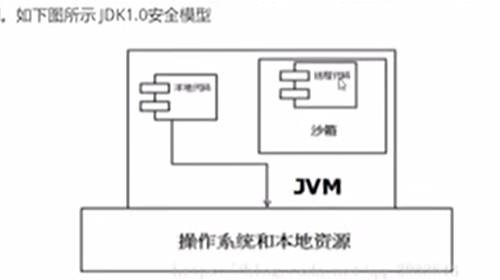
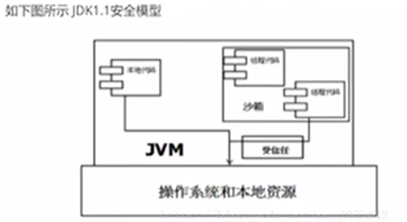
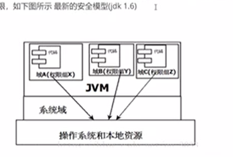

# 沙箱安全机制

1. 沙箱是一个限制程序运行的环境，有些代码只有在特定的条件下才会运行

2. 沙箱机制就是将Java代码限定在虚拟机特定的运行范围中，并且严格限制代码对本地系统资源的访问

3. 本地代码安全，默认是可信任的，但是远程代码不一定安全，对于受信任的本地代码可以访问本地一切资源，而对于非授信的远程代码，在java早期（java1.0）的实现中，安全依赖于沙箱机制

   

4. 但是如此严格的安全机制给程序的拓展带来了阻碍，所以在java1.1的时候增加了安全策略，允许用户指定代码对本地资源的访问权限

   

5. 在java1.2中再次改进了安全机制，增加了代码签名，无论是本地代码还是远程代码都会按照用户安全策略的设定，由类加载器加载到虚拟机中权限不同的运行空间，来实现差异化的代码执行控制权限

   

6. 比如说本地的代码不可以走https，但是java给生成一个证书之后就可以弄https了

7. 到现在为止沿用的是jdk1.6中的安全模型，jdk1.6中引入了一个叫做域的概念（Domain），虚拟机会把所有的代码加载到不同的操作系统域和应用域，系统域部分专门负责域关键资源进行交互，而各个应用域部分通过系统域的部分代理开对各种需要的资源进行访问。虚拟机中不同的受保护域对应不一样的权限，存在不同域中的类文件具有了当前域的所有权限

   

8. 但是我们写的代码几乎没有遇到没让写的地方 早期的时候会限制JVM溢出的情况 现在不限制了 因为一旦溢出了就根本实现不了了

   ```java
   public class Test{
     public static void main(String[] args){
       new Test().a();//如果这样互相递归执行调用 过一会之后就会报一个栈溢出的错误 很多很多不间断
     }
     public void a(){
       b();
     }
     public void b(){
       a();
     }
   }
   ```

9. 所以说java其实是可以写病毒的，比如文件操作疯狂循环生成文件把电脑占满

10. 组成沙箱的基本组件：字节码校验器，类装载器，存储控制器，安全管理器，安全软件包

11. 假设程序有问题，进入字节码校验器就会发现错误，就不会到运行时异常，它的作用就是确保java文件遵循java语言规范，但是并不是所有的文件都会经过字节码校验器，比如核心类，因为这些东西早已经校验过，不可能再出问题了（比如java，javax包）

12. 类加载器在三个方面对java沙箱起作用：防止恶意代码去干涉善意代码（双亲委派机制），它守护了被信任的类库边界，它将代码归入保护域，确定了代码可以进行哪些操作（比如说自己写的代码一般不能调用c的库）

13. 类装载器的机制是双亲委派机制

14. 存取控制器：某些类对系统有操作权限 有一个Robot类 这个类可以写外挂 这个类可以操作电脑 实现鼠标移动 键盘自动按下等等

15. 安全管理器：是核心API和操作系统之间的主要接口，实现权限控制，比存取控制器优先级高

16. 软件安全包：java.security下的类和拓展包下的类，允许用户为自己的应用增加新的安全特性包括：安全提供者，消费摘要，数字签名，加密，鉴别