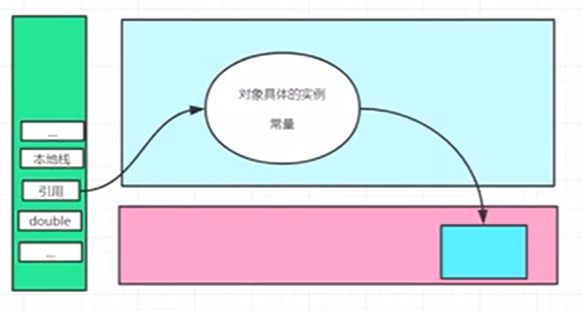

# 深入了解栈

1. 栈是一种数据结构

2. 一般栈跟队列比较

3. 程序=数据结构+算法

4. 栈：先进后出，后进先出，桶

5. 队列：先进先出（FIFO：First Input First Output）

6. 喝多了吐就是栈，吃多了拉就是队列

7. main方法先执行但是最后结束~ 

8. 就是java栈里面运行的时候是一个栈的结构

9. 方法间相互调用就相当于无限压栈，会导致栈溢出问题

10. 栈内存，主管程序的运行，生命周期和线程同步

11. 线程结束，栈内存也就释放了，对于栈来说，不存在内存回收问题

12. 一旦线程结束，栈就没了

13. 栈中放的东西：8大基本类型，对象的引用，实例的方法

14. 栈运行原理：栈以栈帧的形式存在（一片一片的）

15. 假如现在栈里面就一个栈顶和一个栈底，栈顶里面存了一个方法索引，输入输出的参数，本地的变量，Class File引用，父帧，子帧。现在栈顶和栈底是两个栈帧（栈），他们互相为父子关系，栈顶的执行完之后栈顶的栈帧没了

16. 程序中正在执行的方法永远在栈的顶部

17. 栈满了就会抛出错误 StackOverflowError

18. 栈+堆+方法区的交互关系：

    