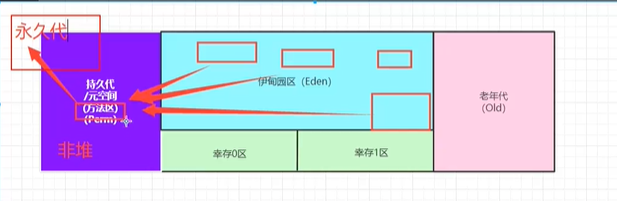

# 新生区，永久区，堆内存调优

### 新生区

1. 一个类诞生，成长，甚至死亡的地方
2. 伊甸园区（所有的对象都是在伊甸园区new出来的），幸存者区（0,1）
3. 假设伊甸园区只能存10个对象，伊甸园区就满了，满了就会触发一次轻GC
4. 现在可能出现几种情况，有的对象还存在引用就活下来了，有的对象没有引用率，他就没用了，就死了。之后把幸存下来的放进幸存区里面，伊甸园区就又有地方了
5. 之后如果幸存0区和幸存1区都满了，就会进养老区
6. 当新生区全满了之后就会触发一次重GC
7. 如果清了很多次，但是新生区和养老区都满了，那就OOM了
8. 真理：经过研究，99%的对象都是临时对象！能真正进入养老区的其实并不多

### 永久区

1. 分为jdk1.6之前，jdk1.7，jdk1.8之后
2. jdk1.6之前：永久代，常量池是在方法区中
3. jdk1.7：永久代，但是慢慢的退化了 当时提出了一个去永久代的概念 常量池在堆中
4. jdk1.8之后：没有永久代了，常量池在元空间
5. 这个区域是常驻内存的，用来存放JDK自身携带的Class对象。Interface元数据，存储的是java运行时的一些环境或类信息，这个区域不存在垃圾回收，关闭虚拟机就会释放这个区域的内存
6. 加入一个启动类加载了大量的第三方jar包，tomcat部署了太多的应用，大量动态生成的反射类，不断的被加载直到内存满就会出现OOM
7. 方法区在持久代（元空间）中，只是有时候我们管方法区叫非堆，目的是与堆分开，非堆也是堆，有的人还会管方法区叫做永久代
8. 常量池在方法区中
9. **元空间在逻辑上存在，但是在物理上不存在**，所以有的人给他分出去，有的人说是一体的

### 堆内存调优

1. 查看当前运行的虚拟机信息

   ```java
   //返回虚拟机试图使用的最大内存
   long max = Runtime.getRuntime().maxMemory(); //字节为单位
   //返回jvm的初始化内存
   long total = Runtime.getRuntime().totalMemory();
   ```

2. 我们可以修改参数了，在VM opitions写-Xms1024m -Xmx1024m -XX:+PrintGCDetails

3. 从打印出来的信息看见两个幸存区一个叫from一个叫to

4. 当我们遇到了OOM，我们先尝试将堆内存扩大看结果，然后是分析问题，看看哪里出了问题（专业工具）