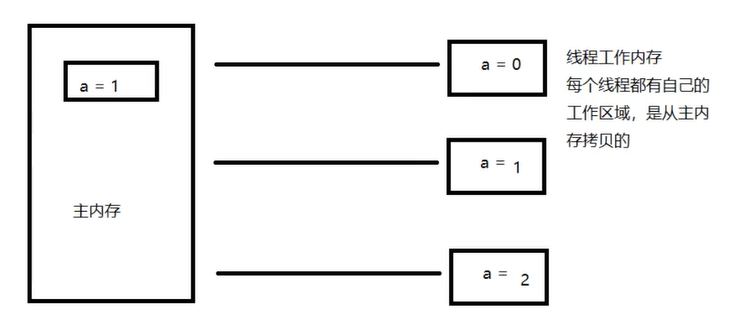

# JMM

1. Java Memory Model java内存模型

2. 缓存一致性协议，用于定义数据读写的规则

3. 每个线程都有一个工作内存，多线程是最容易产生读写关系的

4. JMM定义了线程工作内存和主内存之间的抽象关系，线程之间的共享便利存储在主内存（Main Memory）中，而每个线程都有一个私有的本地内存（Local Memory）

   

5. 每个线程都有自己的工作区域，是从主内存拷贝的

6. 线程中通过主存中复制的一个对象假如说obj的count变量变为2，这个改变该没有通过刷新刷新进主存中，这个变化在另一个cpu线程中不可见，我们就要想办法去解决这个问题，使用**volatile关键字**或者加锁解决共享对象的可见性问题

7. JMM是一个抽象的概念

8. 简单说就是读了必须加载过来，存必须写入，如果数据发生改变了，必须立马告诉主存，不允许将没有assign的数据同步到主存，一个新的变量必须从主存中诞生，一个变量同一时间只能被一个线程取锁，如果一个变量没有被lock就不能对他进行解锁操作，对一个变量进行unlock之前，必须把变量同步回主内存

9. 因为很复杂，所以要用工具看细节